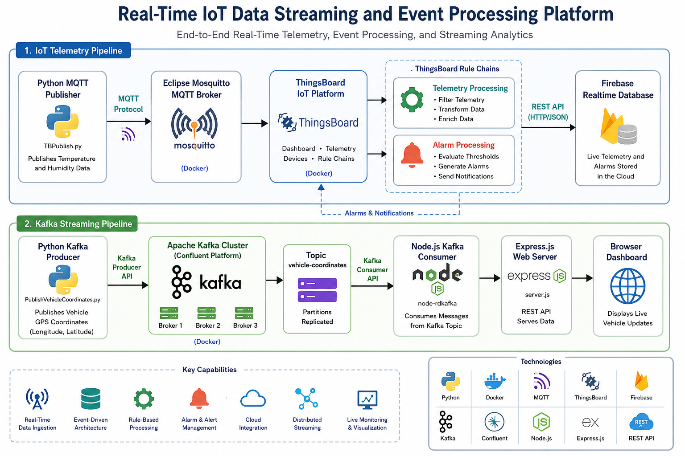
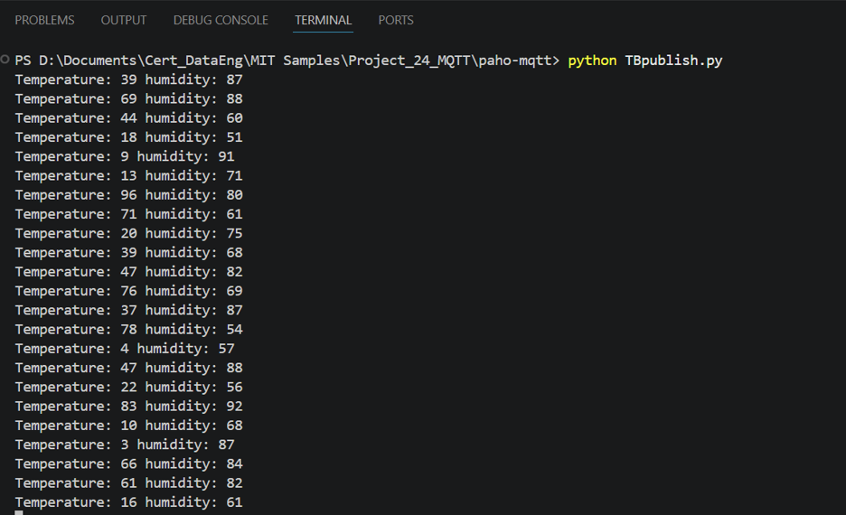
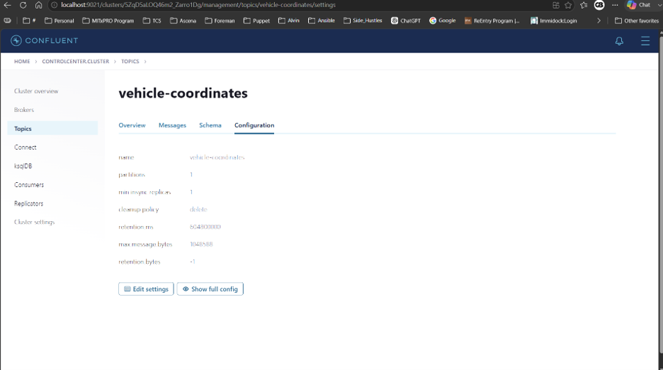

# Real-Time IoT Data Streaming and Event Processing Platform


## Table of Contents

* [Overview](#overview)
* [Architecture](#architecture)
* [Pipeline Summary](#pipeline-summary)
* [Features](#features)
* [Technologies](#technologies)
* [Project Structure](#project-structure)
* [Prerequisites](#prerequisites)
* [Setup Instructions](#setup-instructions)
* [Project Screenshots](#project-screenshots)
* [Lessons Learned](#lessons-learned)
* [Future Improvements](#future-improvements)
* [Author](#author)

## Overview

This project demonstrates an end-to-end real-time IoT data streaming and event-processing platform built using MQTT, Eclipse Mosquitto, ThingsBoard, Firebase Realtime Database, Apache Kafka, Python, Node.js, Express.js, and Docker.

The solution contains two streaming workflows:

* **IoT Telemetry Pipeline** — Simulates temperature and humidity data, publishes the telemetry through MQTT, processes it through ThingsBoard rule chains, and synchronizes telemetry and alarm events to Firebase.
* **Kafka Streaming Pipeline** — Publishes simulated vehicle longitude and latitude data to Apache Kafka and consumes the streaming events through a Node.js and Express.js web application.

The project demonstrates publish-subscribe messaging, real-time event processing, rule-based alarm handling, distributed data streaming, containerized deployment, and cloud-based data integration.

## Architecture



## Pipeline Summary

### IoT Telemetry Pipeline

```text
Python MQTT Publisher
        │
        ▼
Eclipse Mosquitto Broker
        │
        ▼
ThingsBoard IoT Platform
        │
        ├── Latest Telemetry
        │
        └── Rule Chains and Alarm Processing
                         │
                         ▼
              Firebase Realtime Database
```

### Kafka Streaming Pipeline

```text
Python Kafka Producer
        │
        ▼
vehicle-coordinates Topic
        │
        ▼
Apache Kafka Broker
        │
        ▼
Node.js Kafka Consumer
        │
        ▼
Express.js Web Server
        │
        ▼
Browser Output
```

## Features

### IoT Telemetry

* Simulates temperature and humidity telemetry using Python.
* Publishes sensor data using the MQTT publish-subscribe model.
* Runs Eclipse Mosquitto in a Docker container.
* Sends live telemetry to ThingsBoard.
* Displays the latest device telemetry in ThingsBoard.
* Processes incoming telemetry through custom rule chains.
* Evaluates temperature thresholds and generates alarm events.
* Synchronizes telemetry and alarm data to Firebase Realtime Database.

### Kafka Streaming

* Runs a containerized Confluent Kafka environment.
* Creates a dedicated `vehicle-coordinates` Kafka topic.
* Publishes simulated longitude and latitude data using Python.
* Serializes vehicle-coordinate events as JSON.
* Consumes Kafka messages using Node.js and `node-rdkafka`.
* Exposes consumed events through an Express.js web server.
* Displays live vehicle-coordinate messages in a browser.

## Technologies

### Programming Languages

* Python
* JavaScript

### Streaming and Messaging

* Apache Kafka
* MQTT
* Eclipse Mosquitto
* Kafka Producer
* Kafka Consumer
* Publish-Subscribe Messaging

### IoT and Cloud Integration

* ThingsBoard
* Firebase Realtime Database
* ThingsBoard Rule Chains
* REST APIs
* JSON

### Application Development

* Node.js
* Express.js
* Paho MQTT
* `kafka-python`
* `node-rdkafka`

### DevOps and Infrastructure

* Docker
* Docker Compose
* Confluent Platform
* ZooKeeper
* WSL2
* Git
* GitHub

## Project Structure

```text
real-time-iot-data-streaming-platform/
│
├── README.md
├── .gitignore
│
├── docs/
│   └── images/
│       ├── architecture.png
│       ├── alarm-rule-chain.png
│       ├── consumer-output.png
│       ├── firebase-telemetry.png
│       ├── kafka-cluster.png
│       ├── kafka-topic.png
│       ├── mqtt-publisher.png
│       ├── producer-output.png
│       ├── thingsboard-telemetry.png
│       └── web-server.png
│
├── Project_24_Docker/
│   ├── docker-compose.yml
│   └── mosquitto/
│       └── config/
│           └── mosquitto.conf
│
├── Project_24_MQTT/
│   ├── paho-mqtt/
│   │   └── TBPublish.py
│   └── ThingsBoard/
│       └── docker-compose.yml
│
└── Project_Kafka/
    └── Project_24_2_Kafka/
        ├── kafka-docker/
        │   ├── config.js
        │   ├── docker-compose.yml
        │   └── librdkafka.config
        ├── NodeJSConsumer/
        │   ├── myconsumer.js
        │   ├── package.json
        │   ├── package-lock.json
        │   ├── README.md
        │   └── server.js
        └── pythonProducer/
            └── PublishVehicleCoordinates.py
```

## Prerequisites

Install the following tools before running the project:

* Docker Desktop
* Docker Compose
* Python 3.x
* pip
* Node.js
* npm
* Git

Docker Desktop should have sufficient memory available to run the ThingsBoard and Confluent Kafka containers.

## Setup Instructions

### 1. Clone the Repository

```bash
git clone git@github.com:GeethaBheeman/real-time-iot-data-streaming-platform.git
cd real-time-iot-data-streaming-platform
```

HTTPS can also be used:

```bash
git clone https://github.com/GeethaBheeman/real-time-iot-data-streaming-platform.git
cd real-time-iot-data-streaming-platform
```

### 2. Install the Python Dependencies

Install the MQTT and Kafka Python libraries:

```bash
pip install paho-mqtt==1.6.1 kafka-python
```

### 3. Start the Mosquitto MQTT Broker

From the repository root:

```bash
cd Project_24_Docker
docker compose up -d
cd ..
```

Verify that the Mosquitto container is running:

```bash
docker ps
```

### 4. Start ThingsBoard

```bash
cd Project_24_MQTT/ThingsBoard
docker compose up -d
cd ../..
```

Wait for the ThingsBoard container to finish initializing before opening its web interface.

### 5. Configure the ThingsBoard Device

In ThingsBoard:

1. Create a device for the simulated DHT11 sensor.
2. Configure the device access token as `DHT11_DEMO_TOKEN`, or update the token inside `TBPublish.py`.
3. Confirm that the device is available to receive temperature and humidity telemetry.

The publisher currently uses:

```python
THINGSBOARD_HOST = "localhost"
ACCESS_TOKEN = "DHT11_DEMO_TOKEN"
```

For a different environment, update these values or replace them with environment variables.

### 6. Configure Firebase Realtime Database

Create a Firebase Realtime Database and initialize fields for:

```text
temperature
alarm
```

Configure ThingsBoard REST API nodes to send telemetry and alarm data to the Firebase database.

The completed project used rule chains for:

* Sending temperature and humidity telemetry to Firebase.
* Evaluating temperature thresholds.
* Creating and clearing alarms.
* Sending alarm events to Firebase.

Because these ThingsBoard rule chains and Firebase endpoints are environment-specific, they must be configured through the ThingsBoard interface for a new deployment.

### 7. Run the MQTT Publisher

Open a new terminal from the repository root:

```bash
cd Project_24_MQTT/paho-mqtt
python TBPublish.py
```

The publisher generates temperature and humidity values and sends them to the Mosquitto MQTT broker.

Verify the incoming data from the ThingsBoard device’s **Latest Telemetry** view.

### 8. Start the Kafka Platform

Open a new terminal from the repository root:

```bash
cd Project_Kafka/Project_24_2_Kafka/kafka-docker
docker compose up -d
```

The Docker Compose configuration starts the Confluent Kafka services, including the Kafka broker, ZooKeeper, Schema Registry, Kafka Connect, REST Proxy, KSQLDB, and Control Center.

Verify the running services:

```bash
docker ps
```

### 9. Create the Kafka Topic

Using Confluent Control Center, create a topic named:

```text
vehicle-coordinates
```

This topic receives the longitude and latitude events published by the Python producer.

### 10. Run the Kafka Producer

Open another terminal from the repository root:

```bash
cd Project_Kafka/Project_24_2_Kafka/pythonProducer
python PublishVehicleCoordinates.py
```

The producer publishes simulated vehicle coordinates as JSON messages to the `vehicle-coordinates` topic.

### 11. Install the Node.js Dependencies

Open another terminal from the repository root:

```bash
cd Project_Kafka/Project_24_2_Kafka/NodeJSConsumer
npm install
```

The `node_modules` directory is intentionally excluded from Git and is recreated using `package.json` and `package-lock.json`.

### 12. Start the Node.js Consumer

From the `NodeJSConsumer` directory:

```bash
node server.js
```

Open the local browser address displayed by the server.

Use the **Consume Vehicle Coordinates** action to receive and display messages from the Kafka topic.

### 13. Stop the Services

To stop an individual Docker Compose environment, open its directory and run:

```bash
docker compose down
```

For example:

```bash
cd Project_24_Docker
docker compose down
```

Repeat the command from the ThingsBoard and Kafka Docker directories when those environments are no longer needed.

## Project Screenshots

### MQTT Publisher

The Python publisher generates simulated temperature and humidity telemetry and sends it through the Mosquitto MQTT broker.



### ThingsBoard Telemetry

ThingsBoard receives the MQTT events and displays the latest temperature and humidity values for the simulated DHT11 device.


### Firebase Realtime Database

ThingsBoard REST API nodes synchronize temperature and humidity telemetry to Firebase Realtime Database.


### Alarm Processing

Custom ThingsBoard rule chains evaluate temperature thresholds, create or clear alarms, and route alarm events to Firebase.


### Kafka Cluster

Confluent Control Center displays the healthy Kafka cluster and its associated services.


### Kafka Topic

The `vehicle-coordinates` topic receives the simulated longitude and latitude events.



### Kafka Producer

The Python producer continuously publishes vehicle-coordinate messages to Kafka.


### Kafka Consumer

The Node.js consumer receives and processes vehicle-coordinate events from the Kafka broker.


### Browser Application

The Express.js application provides a browser interface for consuming and displaying live vehicle-coordinate messages.


## Lessons Learned

During this project, I gained hands-on experience in:

* Building end-to-end event-driven data architectures.
* Implementing MQTT publish-subscribe messaging.
* Configuring and operating a Mosquitto MQTT broker.
* Processing live telemetry with ThingsBoard.
* Designing rule chains for event routing and alarm generation.
* Integrating ThingsBoard with Firebase through REST APIs.
* Deploying distributed services using Docker Compose.
* Configuring Apache Kafka and the Confluent Platform.
* Creating and managing Kafka topics.
* Developing Python-based Kafka producers.
* Building Node.js Kafka consumers using `node-rdkafka`.
* Exposing streaming events through an Express.js web application.
* Troubleshooting Docker networking, service dependencies, and distributed messaging workflows.

## Future Improvements

* Deploy Kafka and ThingsBoard using Azure Kubernetes Service.
* Store streaming telemetry in Azure Data Lake Storage.
* Process live events using Apache Spark Structured Streaming.
* Build Power BI dashboards for telemetry analytics.
* Add Prometheus and Grafana for platform monitoring.
* Implement GitHub Actions for continuous integration and deployment.
* Secure MQTT communication using authentication and TLS.
* Store credentials and tokens using environment variables or a secrets manager.
* Add automated tests for the Python producer and Node.js consumer.
* Introduce schema validation for Kafka event payloads.

## Author

**Geetha Bheeman**

MIT xPRO — Professional Certificate in Data Engineering
