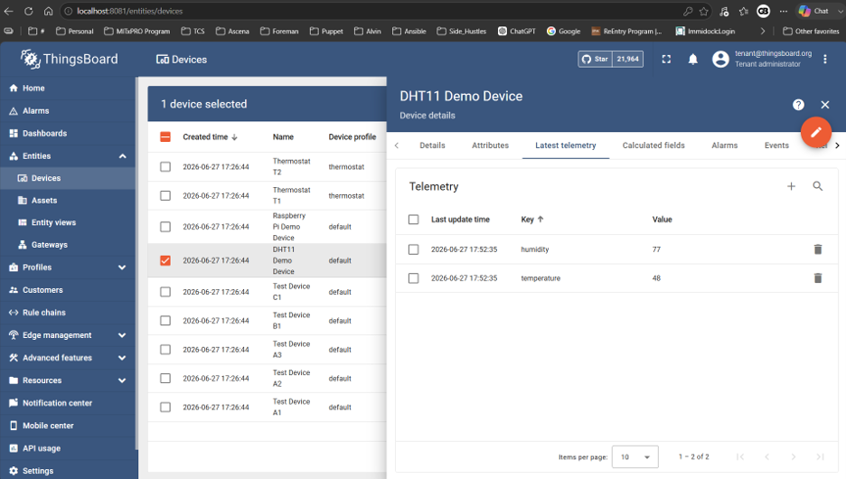
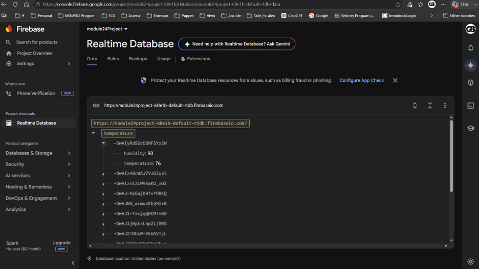
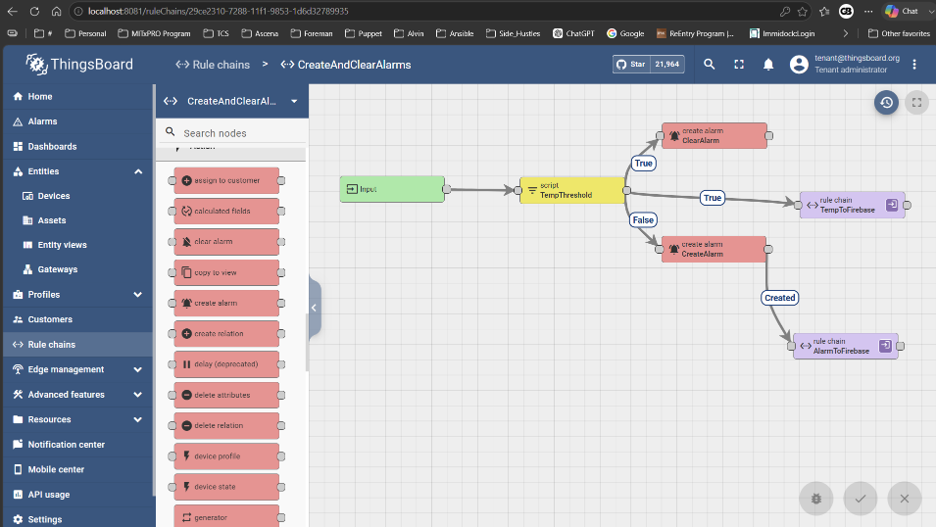
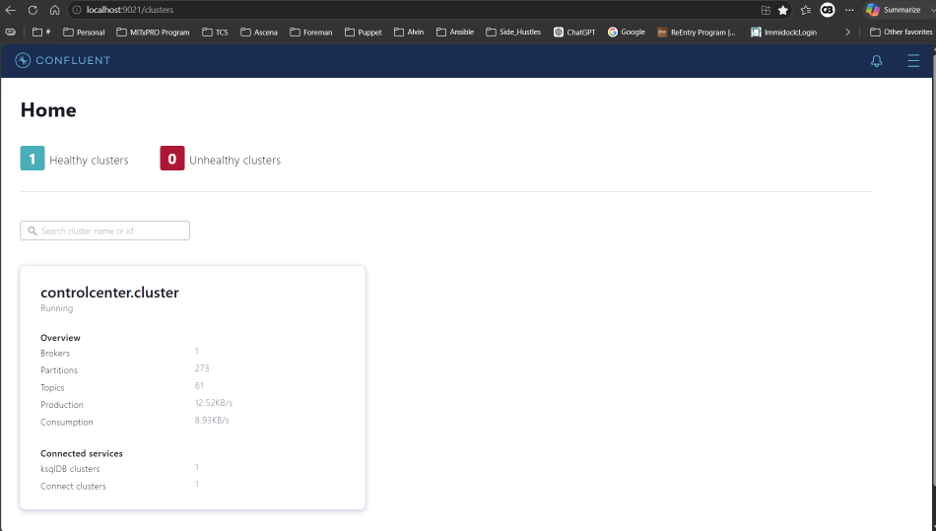
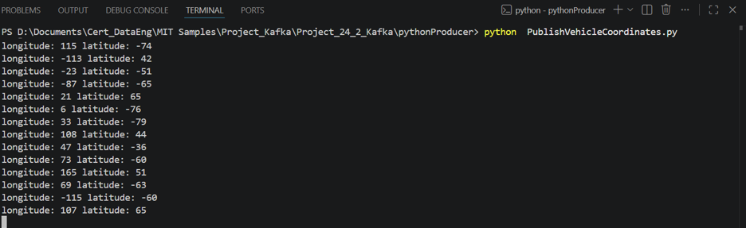
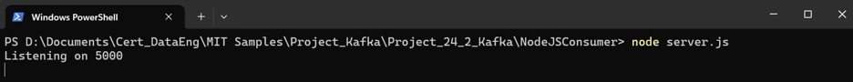
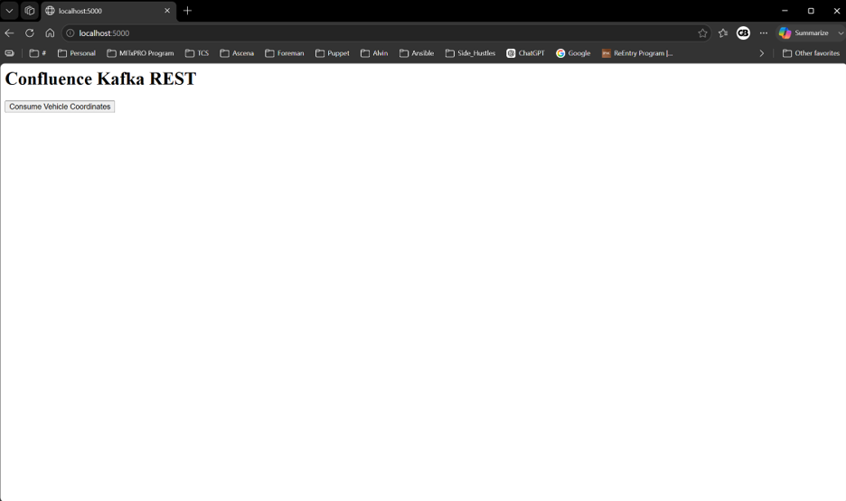

# Real-Time IoT Data Streaming and Event Processing Platform

## Overview

This project demonstrates an end-to-end real-time IoT data streaming platform built using MQTT, ThingsBoard, Firebase, Apache Kafka, Python, Node.js, and Docker.

The solution consists of two integrated streaming pipelines:

- **IoT Telemetry Pipeline** – Simulates temperature and humidity sensor data, processes telemetry using ThingsBoard rule chains, and synchronizes live data and alarms to Firebase.
- **Kafka Streaming Pipeline** – Publishes vehicle GPS coordinates to Apache Kafka and consumes the messages using a Node.js web server.

The project demonstrates real-time event processing, publish-subscribe messaging, distributed streaming, containerized deployment, and cloud integration.

---

# Architecture

```text
                    IoT Telemetry Pipeline

           +----------------------+
           | Python MQTT Publisher|
           +----------+-----------+
                      |
                      |
                      v
              Eclipse Mosquitto
                      |
                      |
                      v
               ThingsBoard
                      |
        +-------------+--------------+
        |                            |
        | Rule Chains                |
        | Alarm Processing           |
        |                            |
        +-------------+--------------+
                      |
                      |
                      v
          Firebase Realtime Database


                 Kafka Streaming Pipeline

      Python Kafka Producer
                |
                |
                v
          Apache Kafka Topic
                |
                |
                v
        Node.js Kafka Consumer
                |
                |
                v
        Express Web Server
                |
                |
                v
              Browser
```

---

# Features

## IoT Telemetry

- Simulated temperature and humidity telemetry
- MQTT publish-subscribe messaging
- Dockerized Mosquitto broker
- ThingsBoard telemetry processing
- Custom ThingsBoard Rule Chains
- Threshold-based alarm generation
- Firebase cloud synchronization

## Kafka Streaming

- Dockerized Confluent Kafka Platform
- Kafka Producer using Python
- Kafka Consumer using Node.js
- Vehicle GPS coordinate streaming
- Browser-based message visualization

---

# Technologies

### Languages

- Python
- JavaScript
- Node.js

### Streaming

- Apache Kafka
- MQTT
- Eclipse Mosquitto

### IoT

- ThingsBoard
- Firebase Realtime Database

### DevOps

- Docker
- Docker Compose

### Other

- REST APIs
- JSON
- Express.js

---

# Project Structure

```text
Project_24_Docker/
    docker-compose.yml
    mosquitto/
        config/

Project_24_MQTT/
    paho-mqtt/
        TBPublish.py
    ThingsBoard/
        docker-compose.yml

Project_Kafka/
    Project_24_2_Kafka/
        kafka-docker/
        NodeJSConsumer/
        pythonProducer/
```

---

# Setup Instructions

## 1. Clone Repository

```bash
git clone git@github.com:GeethaBheeman/real-time-iot-data-streaming-platform.git
```

---

## 2. Start Mosquitto

```bash
docker compose up
```

---

## 3. Start ThingsBoard

```bash
docker compose up
```

---

## 4. Run MQTT Publisher

```bash
python TBPublish.py
```

---

## 5. Start Kafka Platform

```bash
docker compose up
```

---

## 6. Run Kafka Producer

```bash
python PublishVehicleCoordinates.py
```

---

## 7. Start Node.js Consumer

```bash
node server.js
```

---

# Project Screenshots

## MQTT Telemetry



Live temperature and humidity telemetry published from Python to ThingsBoard.

---

## Firebase Realtime Database



Telemetry synchronized from ThingsBoard to Firebase using REST API nodes.

---

## Alarm Processing



ThingsBoard Rule Chain evaluating temperature thresholds and generating alarms.

---

## Kafka Cluster



Confluent Control Center showing a healthy Kafka cluster.

---

## Kafka Producer



Python producer publishing longitude and latitude messages.

---

## Kafka Consumer



Node.js consumer receiving streaming messages from Kafka.

---

## Browser



Express application displaying live consumed messages.

---

# Lessons Learned

Through this project I gained practical experience in:

- Designing event-driven architectures
- Building publish-subscribe messaging systems
- Configuring MQTT brokers
- Implementing ThingsBoard Rule Chains
- Integrating Firebase with REST APIs
- Deploying distributed services using Docker Compose
- Configuring Apache Kafka and Confluent Platform
- Developing Kafka producers and consumers
- Building Node.js streaming applications
- Troubleshooting distributed systems and container networking

---

# Future Improvements

- Deploy Kafka and ThingsBoard to Azure
- Secure MQTT communication using TLS
- Add Prometheus and Grafana monitoring
- Persist Kafka streams into a Data Lake
- Integrate Apache Spark Structured Streaming
- Implement CI/CD using GitHub Actions

---

# Author

**Geetha Bheeman**

MIT xPRO – Professional Certificate in Data Engineering
